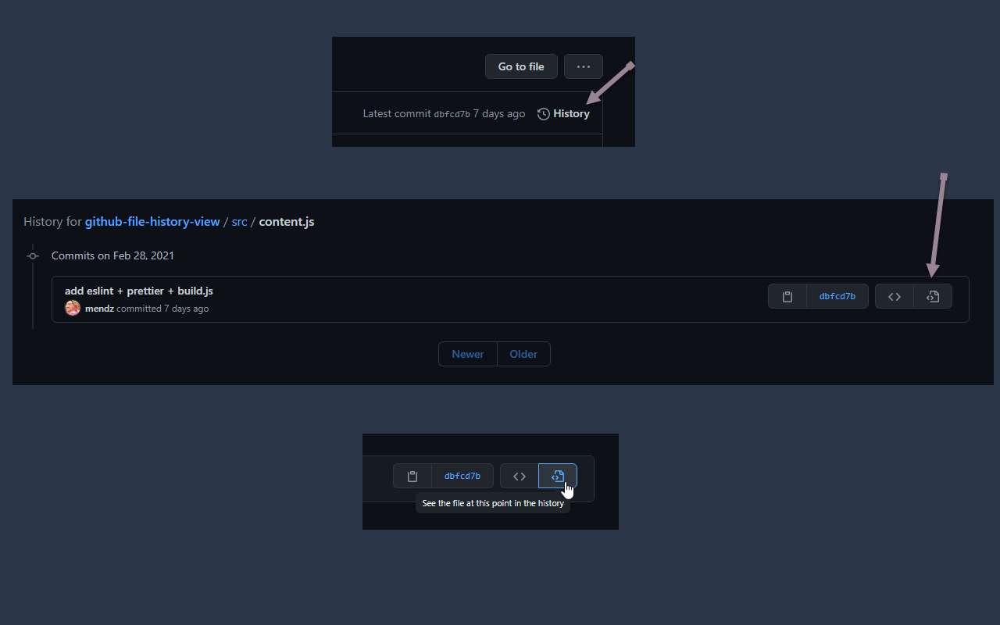

# Github File History By Commits - View File

When viewing history for a single file, adds a new button with a link to view the file at the commit point in the history.

Document SVG icon is from: <https://heroicons.dev/>.

Works only on `https://github.com/*`, run the code only if the page is "_History for_" (`https://github.com/*/*/commits/*`) pages with the breadcrumbs.

